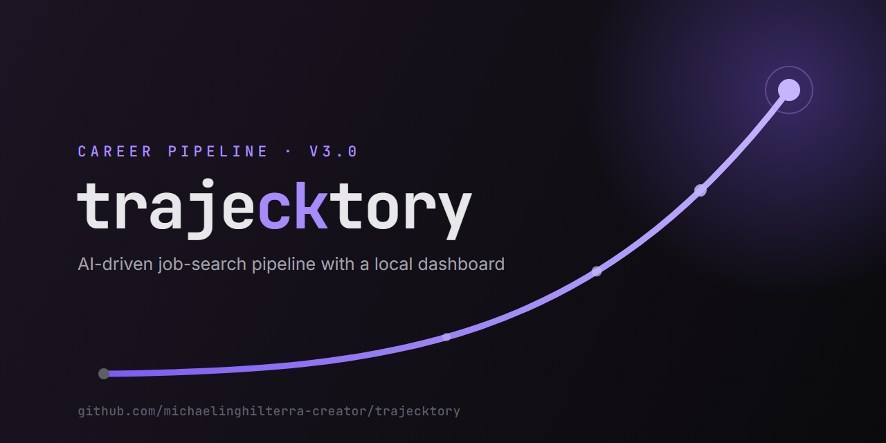
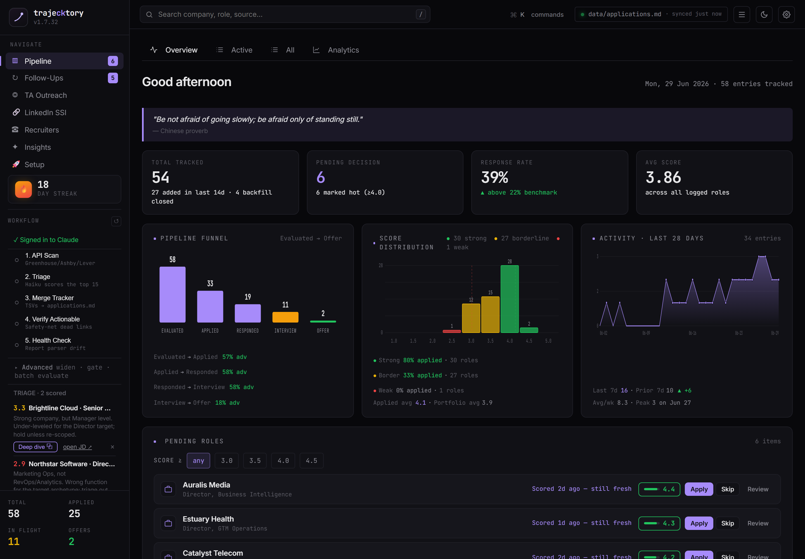
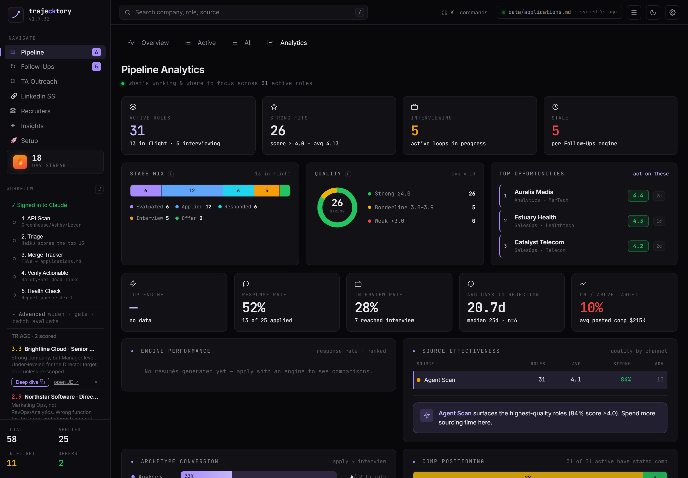
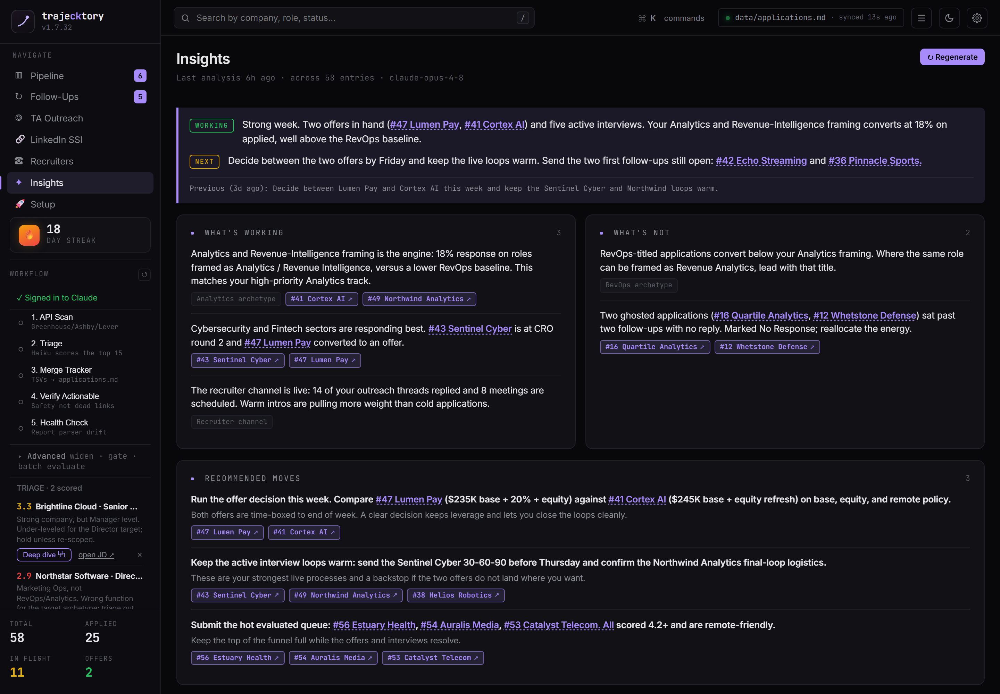
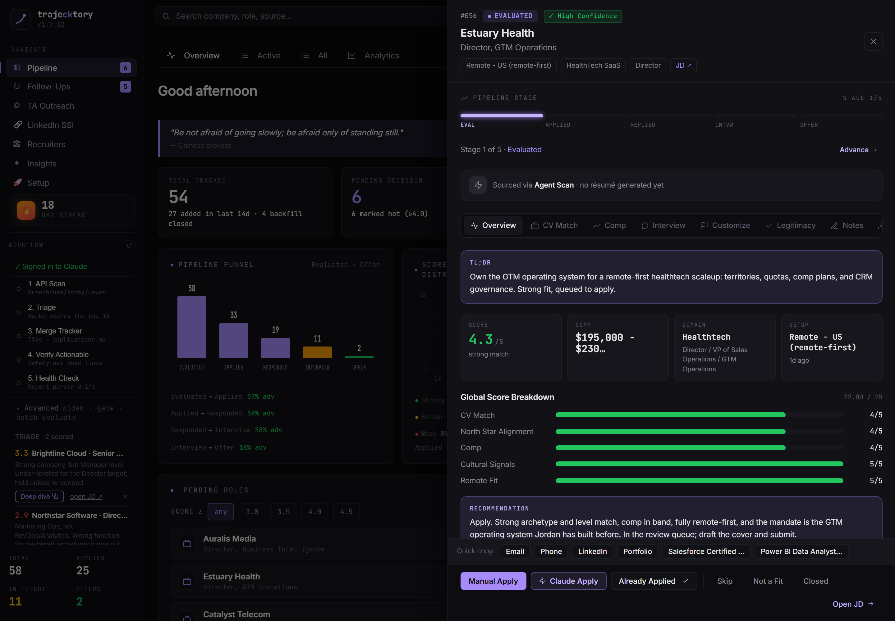
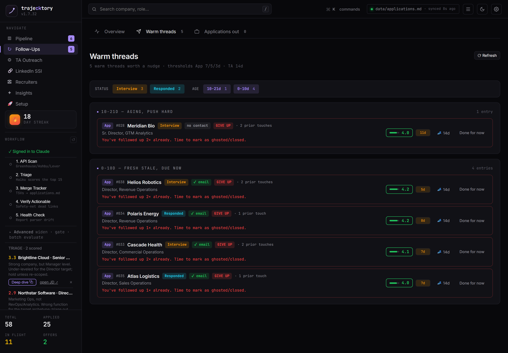
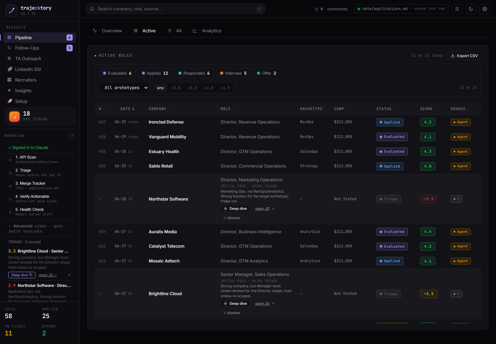
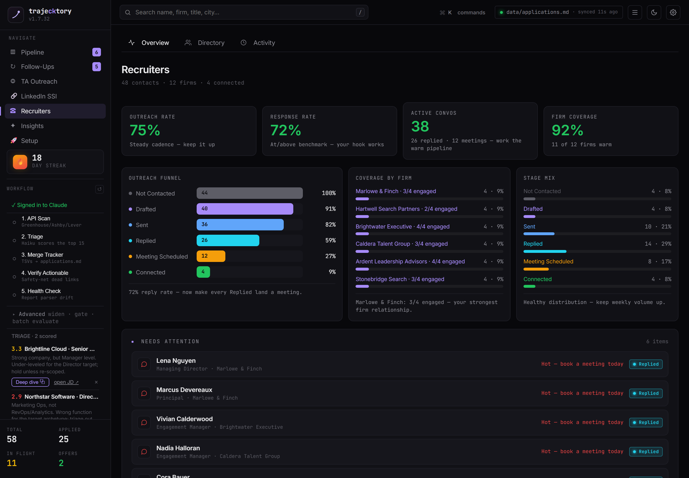

# trajecktory

<p align="center">
  
</p>

<p align="center">
  <strong>The complete job hunt, run from one dashboard.</strong><br>
  Companies use AI to filter candidates. trajecktory gives you AI to <em>choose</em> companies — scan, evaluate, tailor, apply, track, and follow up, all from a local web dashboard.
</p>

<p align="center">
  
  
  
  
  
  
</p>

<p align="center">
  
</p>

<p align="center">
  
  
</p>

<p align="center">
  
  
</p>

<p align="center">
  
  
</p>

---

## Download (Windows, no setup)

**Just want to run it?** Download the Windows installer from the
**[latest release](https://github.com/michaelinghilterra-creator/trajecktory/releases/latest)**
and run it. It bundles everything (Node, Chromium, Claude Code, and Git) and installs in a
few clicks. The only thing you provide is a [Claude](https://claude.ai) subscription (a paid
plan) and a one-time sign-in.

> The installer is not code-signed yet, so Windows SmartScreen may warn "unknown publisher"
> on first run. Click **More info -> Run anyway**.

Prefer to run from source (Node + Claude Code)? See **[docs/SETUP.md](docs/SETUP.md)**.

## First run: what to expect

From download to your first evaluated role. The installer and the in-app Launchpad do the heavy lifting; you mostly review and confirm.

1. **Install.** Run the installer (a few clicks; it bundles Node, Chromium, Claude Code, and Git). If Windows SmartScreen warns "unknown publisher," click **More info -> Run anyway**. Restart if it asks (that puts Git on your PATH).
2. **Launch.** Open trajecktory from the desktop/Start Menu shortcut, or tell Claude Desktop in Code mode "Start the live dashboard." It starts a local server and opens the dashboard at http://localhost:3333.
3. **Take any update.** If an "Update available" banner appears, click **Update now**. It is one-click and updates system files only, so your CV, profile, tracker, and reports are never touched.
4. **Work the Launchpad.** The Setup tab guides you with a readiness meter: paste your CV (or a LinkedIn URL, or upload a file), then confirm your identity, target roles, your edge, compensation, location rules, evaluation tuning, and companies to track. The generative steps hand you a copy-paste prompt to run in your own Claude Code; the rest you fill in and save.
5. **Sign in to Claude.** Click "Sign in to Claude" in the left sidebar once (the bundled `claude login` on your own Claude plan). This is what lets Evaluate and Scan run. No Anthropic API key is required; everything runs on your Claude subscription. An optional key is only a faster path for the writing features.
6. **(Optional) Models and cost.** Under Setup -> Models & cost you can pick which model runs each step, see the approximate cost per run, and flip billing between your Claude plan and an API key. Sensible, cheaper defaults are already applied, so you can skip this.
7. **Run your first search.** From the left sidebar: API Scan (free, no AI) pulls fresh roles, then Triage scores the best fits (the API-key workflow uses Agent Scan and Evaluate instead). Review the scored roles, deep-dive the strongest, let trajecktory tailor a resume and cover letter, and track it. It schedules the follow-ups.

Fuller version with more context: **[docs/onboarding/first-run.md](docs/onboarding/first-run.md)**. Illustrated walkthrough with screenshots: the guides in **[docs/onboarding](docs/onboarding)** (`guide1.html`, `guide2.html`).

## What Is This

trajecktory is a local, AI-driven command center for the entire job search, run from a web dashboard. Instead of juggling spreadsheets, browser tabs, and one-off prompts, you get a single pipeline that:

- **Scans** ATS portals (Greenhouse, Ashby, Lever, company pages) for new roles
- **Evaluates** each posting against your CV with a structured A-F score across 10 weighted dimensions, plus a Block G posting-legitimacy check
- **Tailors** an ATS-optimized Word resume and cover letter per role
- **Tracks** every application in one source of truth, with integrity checks
- **Manages outreach** — a recruiter CRM, in-network (target-talent) outreach, and LinkedIn engagement, with AI-drafted messages in your voice
- **Schedules follow-ups** on a sensible cadence so nothing goes stale
- **Coaches** you with analytics on conversion, archetype fit, and rejection patterns

> **Not a spray-and-pray tool.** trajecktory is a filter — it surfaces the few roles worth your time out of hundreds and recommends against applying below 4.0/5. It never submits anything; you always have the final call.

## The Dashboard

Everything runs from a local web dashboard (`http://localhost:3333`, bound to `127.0.0.1` — your data never leaves your machine):

- **Launchpad** — guided first-run setup with a readiness meter
- **Overview & Insights** — pipeline health, conversion rates, and coaching analytics
- **Pipeline & Tracker** — browse, filter, and sort every application; a per-role drawer renders the full A-G evaluation as a cheat sheet
- **Recruiters & Target Talent** — CRMs for external recruiters and in-network contacts, with AI-drafted, voice-matched outreach
- **LinkedIn SSI** — track and draft engagement to grow your network deliberately
- **One-click actions** — Scan and Evaluate run agentically in the background; Apply generates your tailored CV + cover letter

## How It Works

1. **Onboard** in the Launchpad: add your CV, profile, and target roles
2. **Scan** portals (or paste a single job URL); dead postings are liveness-gated out before any AI spend
3. **Evaluate** — Claude reads each posting against your CV (reasoning about fit, not keyword matching) and writes a structured report
4. **Tailor** — generate a docx resume + cover letter customized to the role
5. **Track & act** — manage status, follow-ups, and recruiter / in-network outreach from the dashboard
6. **Learn** — insights show what's converting so you target better over time

## Quick Start

```bash
# 1. Clone and install
git clone https://github.com/michaelinghilterra-creator/trajecktory.git
cd trajecktory
npm ci
npm --prefix dashboard-web ci
npx playwright install chromium     # liveness checks + scraping

# 2. Launch the dashboard
npm --prefix dashboard-web start    # → http://localhost:3333
```

Open the dashboard and the **Launchpad** tab walks you through adding your CV, profile, and target companies. Run `node doctor.mjs` anytime to validate prerequisites.

> **Credentials:** Evaluate and Scan run on **your own Claude Pro/Max login** (via the bundled `claude` CLI — no per-use API cost). Resume / cover-letter and outreach drafts use **your own Anthropic API key**, which you can add during setup or later. None of this is shared with anyone.

## Also Runs in Any Agent CLI

Prefer the terminal? The same engine works headless. trajecktory follows the [open agent skill standard](https://agentskills.io), so it runs in Claude Code, Gemini CLI, or OpenCode — paste a job URL or use the slash commands. See [docs/SETUP.md](docs/SETUP.md) for the CLI workflow.

## Pre-configured Portals

The scanner ships with **45+ companies** and **19 search queries** across major boards. Copy `templates/portals.example.yml` to `portals.yml` and add your own:

**AI Labs:** Anthropic, OpenAI, Mistral, Cohere, LangChain, Pinecone
**Voice AI:** ElevenLabs, PolyAI, Parloa, Hume AI, Deepgram, Vapi, Bland AI
**AI Platforms:** Retool, Airtable, Vercel, Temporal, Glean, Arize AI
**Contact Center:** Ada, LivePerson, Sierra, Decagon, Talkdesk, Genesys
**Enterprise:** Salesforce, Twilio, Gong, Dialpad
**LLMOps:** Langfuse, Weights & Biases, Lindy, Cognigy, Speechmatics
**Automation:** n8n, Zapier, Make.com
**European:** Factorial, Attio, Tinybird, Clarity AI, Travelperk

**Job boards searched:** Ashby, Greenhouse, Lever, Wellfound, Workable, RemoteFront

## Tech Stack


- **Dashboard:** Node/Express + React (esbuild), served locally on `127.0.0.1`
- **Agent:** Claude Code (also Gemini CLI / OpenCode) with custom skills and modes
- **CV:** docx generation via adm-zip slot-swap (default), preserving your master template byte-for-byte
- **Scanner:** Playwright + ATS APIs
- **Data:** local Markdown + YAML + TSV — no database, no cloud, no telemetry

## Origin

trajecktory began as [career-ops](https://github.com/santifer/career-ops) by **santifer** (MIT) — a CLI-first job-search tool he used to evaluate 740+ offers, generate 100+ tailored CVs, and land a Head of Applied AI role ([his case study](https://santifer.io/career-ops-system)). trajecktory builds on that foundation and reshapes it into a dashboard-driven, full-pipeline product.

## Ethical Use

trajecktory is built for quality, not quantity. It never submits an application on your behalf — it fills forms, drafts answers, and generates resumes, then stops so you make the final call. It strongly discourages low-fit applications (below 4.0/5), because your time and the recruiter's are both worth respecting. A well-targeted application to five companies beats a generic blast to fifty.

## Disclaimer

**trajecktory is a local, open-source tool — NOT a hosted service.** By using this software, you acknowledge:

1. **You control your data.** Your CV, contact info, and personal data stay on your machine and are sent directly to the AI provider you choose. We do not collect, store, or have access to any of your data.
2. **You control the AI.** The default prompts instruct the AI not to auto-submit applications, but models can behave unpredictably. If you modify the prompts or use different models, you do so at your own risk. **Always review AI-generated content for accuracy before submitting.**
3. **You comply with third-party ToS.** Use this tool in accordance with the Terms of Service of the career portals you interact with (Greenhouse, Lever, Workday, LinkedIn, etc.). Do not use it to spam employers or overwhelm ATS systems.
4. **No guarantees.** Evaluations are recommendations, not truth. AI models may hallucinate skills or experience. The authors are not liable for employment outcomes, rejected applications, account restrictions, or any other consequences.

See [LEGAL_DISCLAIMER.md](LEGAL_DISCLAIMER.md) for full details. Provided under the [MIT License](LICENSE) "as is", without warranty of any kind.

## License

The code is licensed under [MIT](LICENSE). "trajecktory" is the project's brand name: forks are welcome under MIT, but please use your own product name and do not imply endorsement.
