# trajecktory

<p align="center">
  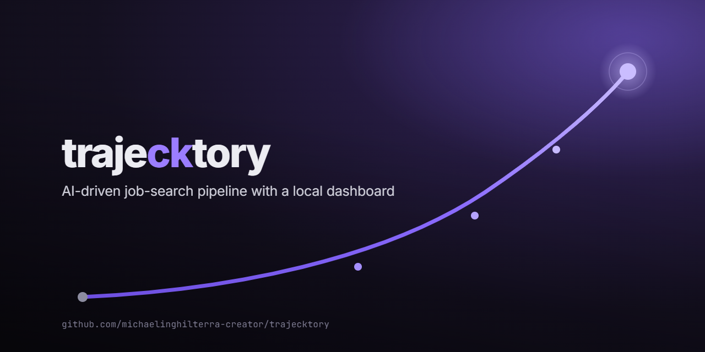
</p>

<p align="center">
  <strong>Your entire job search, run from one dashboard.</strong><br>
  Companies use AI to filter you out. trajecktory gives you AI to run the whole search: find the roles worth your time, tailor for each one, work the right people, and never let a thread go cold. All local, all yours.
</p>

<p align="center">
  
  
  
  
  
  
</p>

<p align="center">
  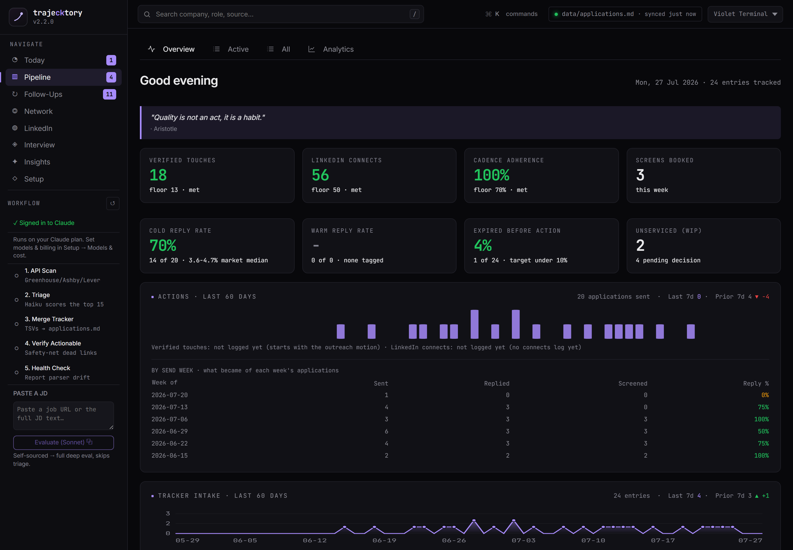
</p>

<p align="center">
  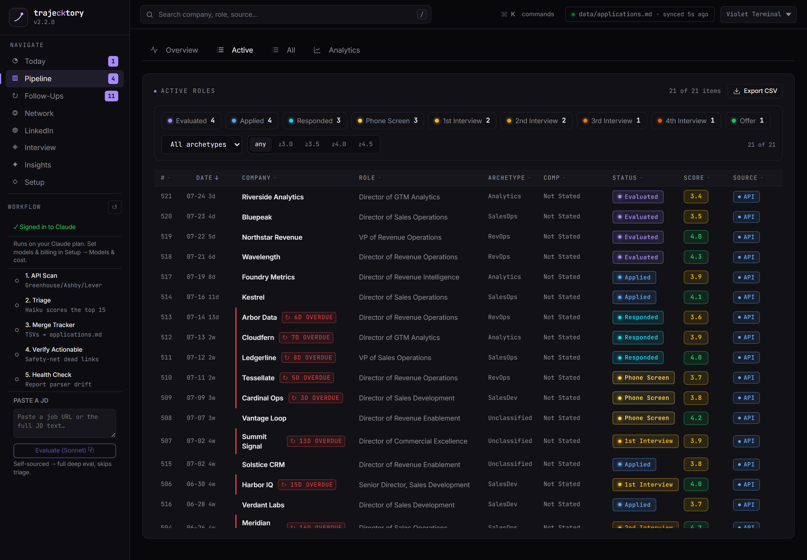
  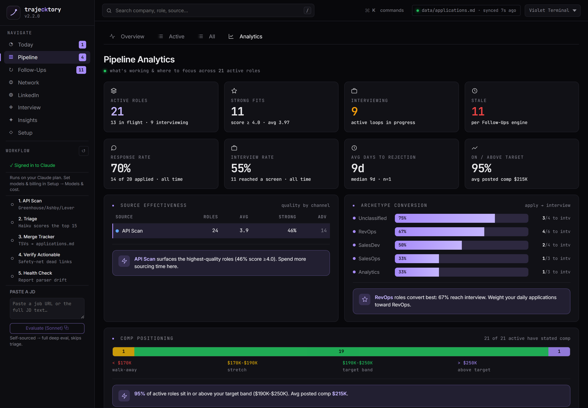
</p>

<p align="center">
  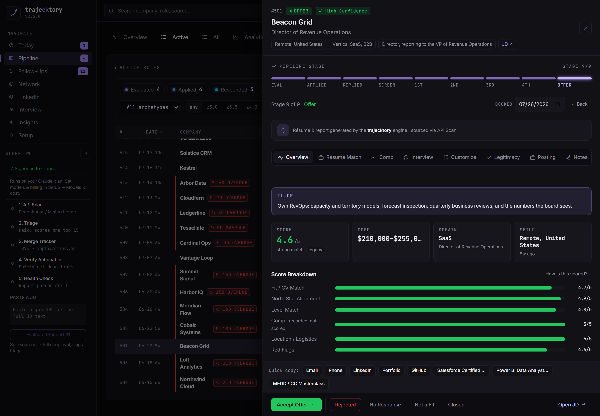
  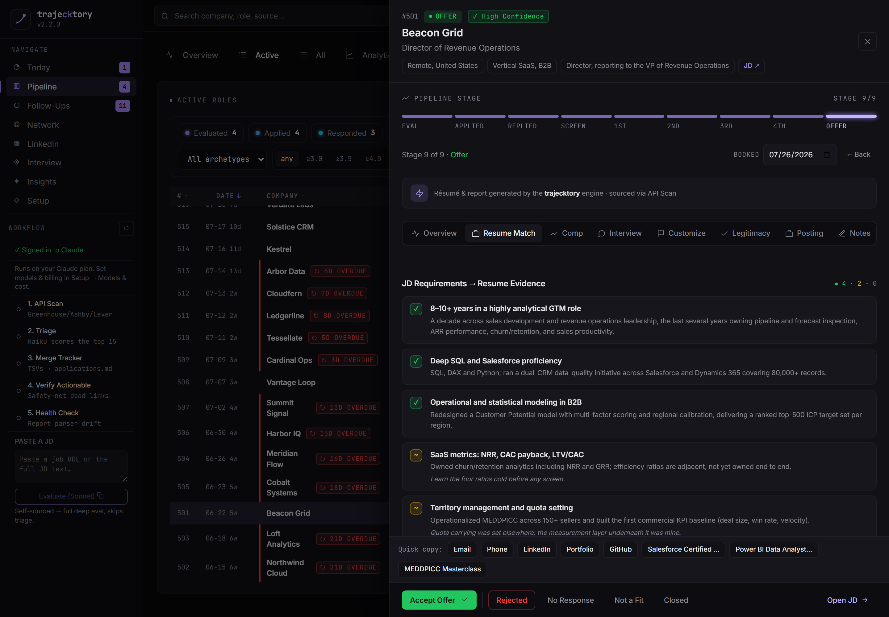
</p>

<p align="center">
  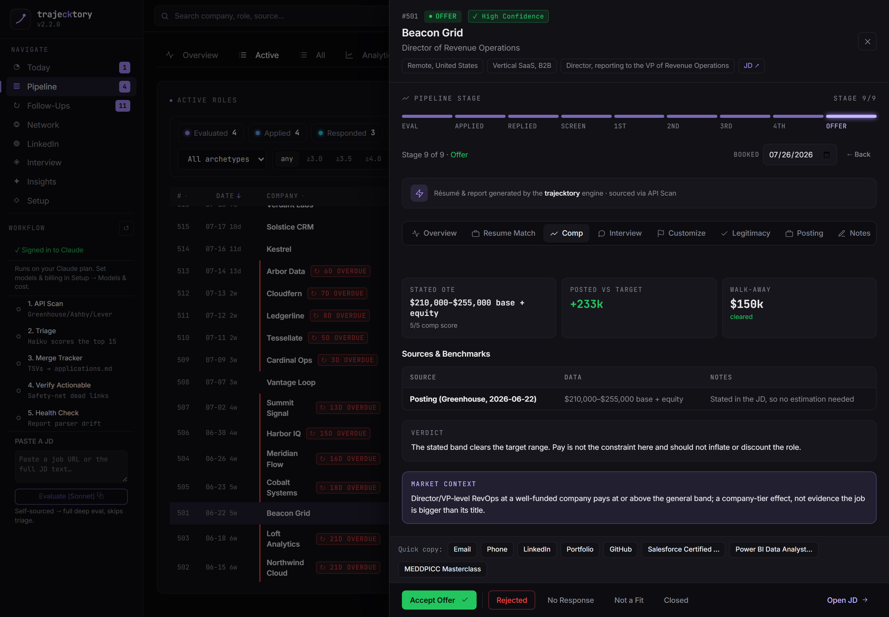
  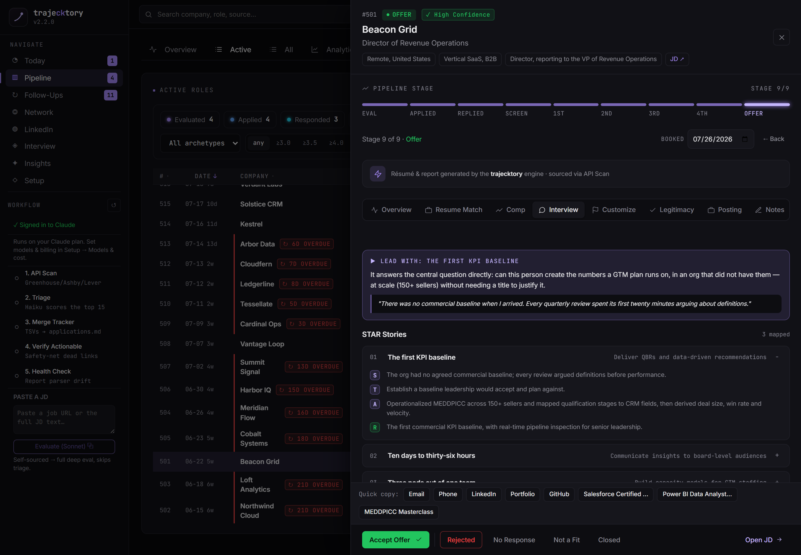
</p>

<p align="center">
  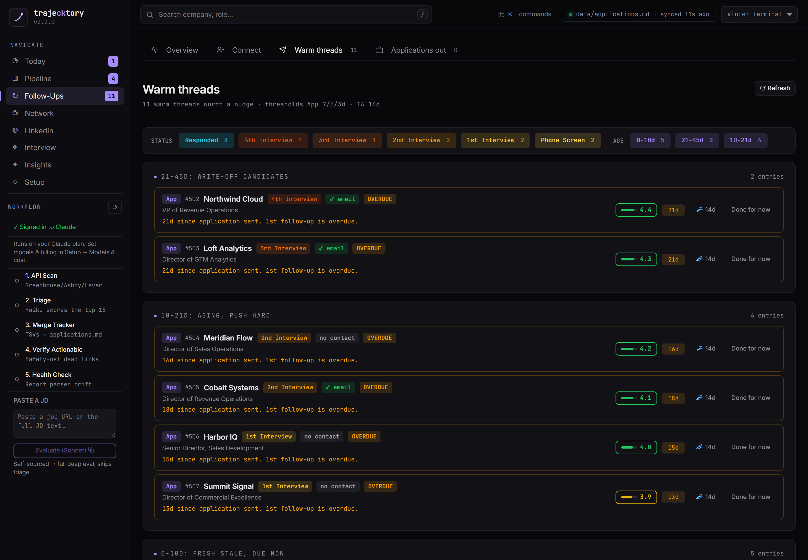
  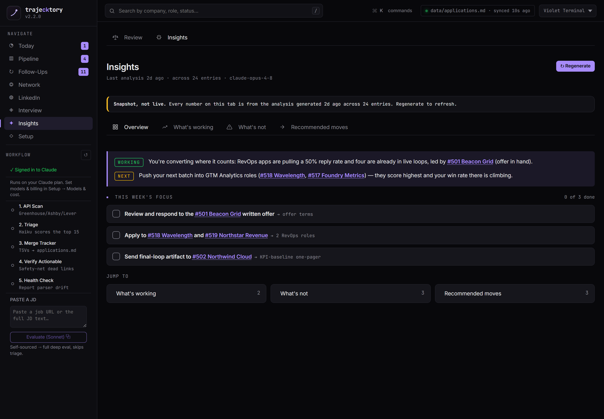
</p>

<p align="center">
  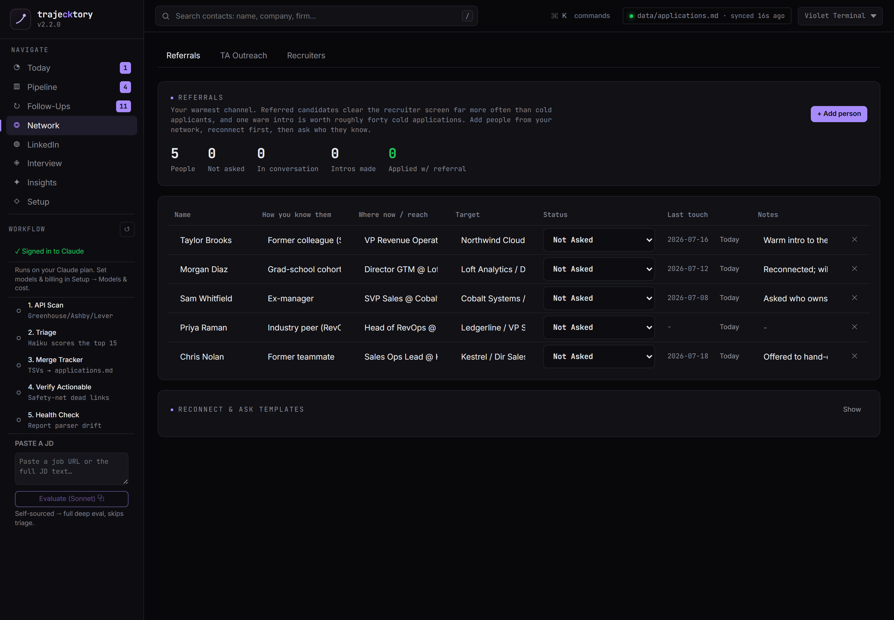
  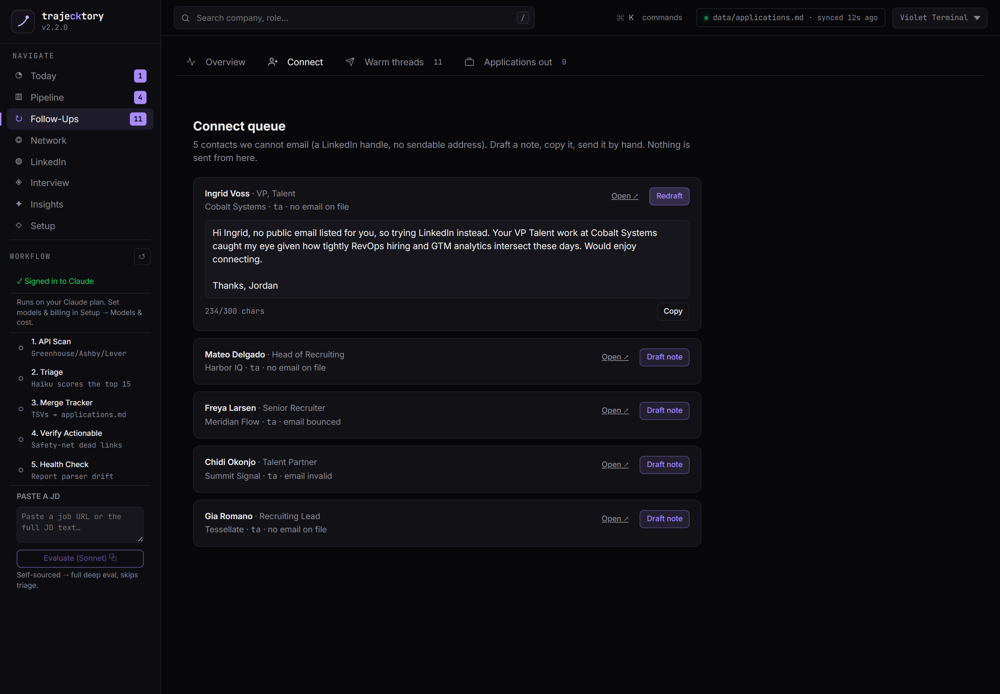
</p>

<p align="center">
  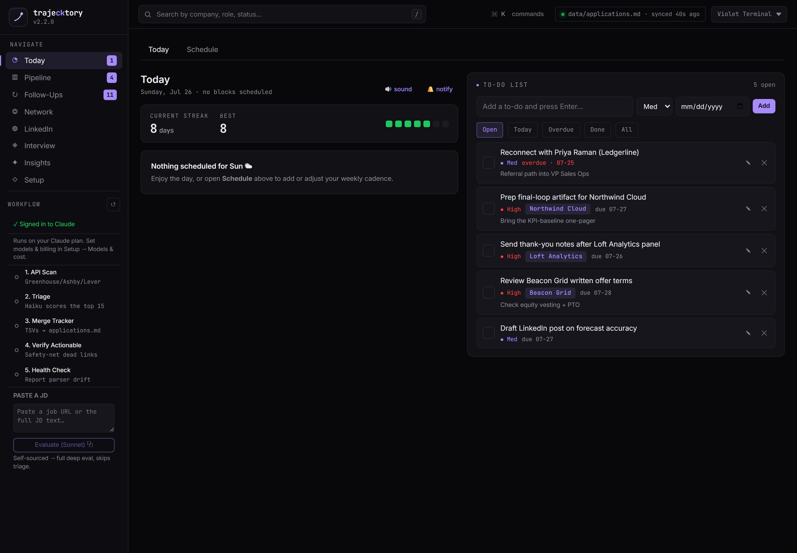
  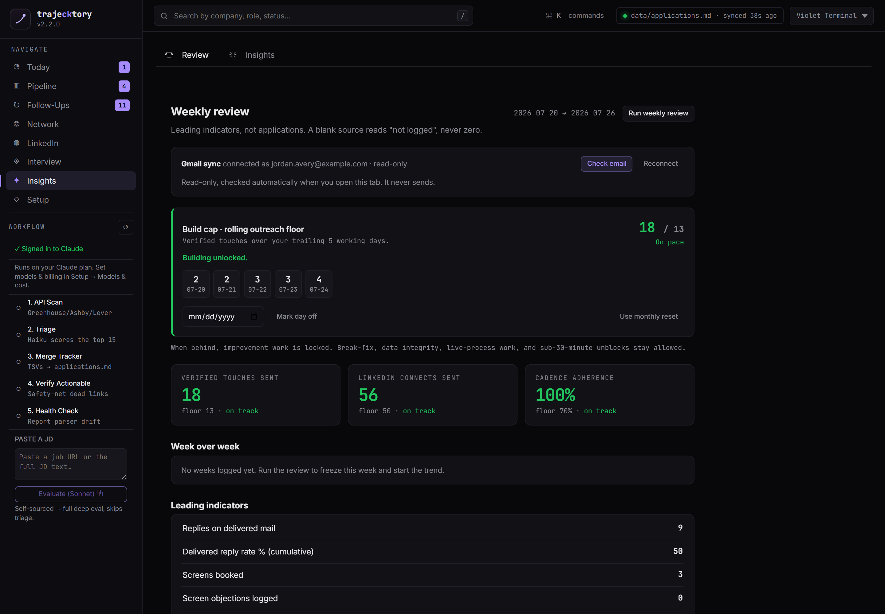
</p>

---

## Why this exists

A modern job search is a dozen disconnected tools: a spreadsheet, forty browser tabs, your inbox,
LinkedIn, a folder of resume versions, and a nagging feeling you forgot to follow up with someone.
The busywork crowds out the two things that actually move a search forward: reaching the right
people, and putting a genuinely tailored application in front of them.

trajecktory collapses all of it into **one local command center**. You control your entire
job-search ecosystem and workflow from a single dashboard on your own machine, so your time goes to
the few roles worth it and the people who can actually help.

## What it does for you

- **Saves you time on the wrong roles.** It scans job boards (Greenhouse, Ashby, Lever, company
  pages), scores every posting against your actual CV with a structured A-to-G report, and tells you
  which handful is worth your energy. It recommends against anything below a real fit, because your
  time and the recruiter's are both worth respecting.
- **Tailors each application, for real.** One click produces an ATS-clean Word resume and cover
  letter tuned to that specific posting, down to reordering your bullets to lead with what the role
  cares about. Tailoring is the single largest lever in the data, and this is the lever pulled.
- **Makes sure nothing goes cold.** It schedules your follow-ups on a sensible cadence, shows you at
  a glance who is overdue and who to give up on, and drafts the nudge for you. The thread you would
  have forgotten is the one it surfaces.
- **Finds and works the right contacts.** A recruiter CRM and an in-network (target-talent) CRM, a
  LinkedIn connection queue for people you can only reach there, and LinkedIn and X posts drafted in
  your voice and scheduled through Buffer, so you build inbound while you work outbound.
- **Reads your inbox so you do not have to.** An optional, read-only Gmail connection catches
  replies and bounces, logs each against the right application, and drafts your response. It never
  sends anything on its own.
- **Every AI-written message is yours to edit.** Outreach emails, LinkedIn notes, follow-ups, posts:
  each one lands in an editable field, and you tweak it before it goes anywhere. Nothing is a black
  box you have to accept.
- **Coaches you with honest numbers.** A weekly scorecard measures the inputs you control against
  floors and your outcomes against sourced benchmarks. Conversion is reported by the furthest stage
  each role ever reached, thin samples are flagged as too few to rate rather than guessed, and there
  are no fabricated benchmarks anywhere.
- **Preps you for the room.** Per-company interview prep opens as a glance (who, when, the opening,
  the one story, the reset) with the deep reference one click away, not a wall of text.

> **Not a spray-and-pray tool.** trajecktory is a filter, not a firehose. It surfaces the few roles
> worth applying to and argues against the rest. It never submits anything: it fills the forms,
> drafts the answers, and generates the documents, then stops so you make the final call.

## Local, private, yours

Everything runs on `http://localhost:3333`, bound to `127.0.0.1`. Your CV, contacts, tracker, and
mail stay on your machine and are sent only to the AI provider you choose. No cloud, no database, no
telemetry, no account. The tool works for you and answers to you.

## Getting Started

Two ways to run trajecktory. Both need one thing and one thing only: a paid
[Claude](https://claude.ai) plan (Pro or Max). Everything else is either bundled for you or a single
copy-paste block below.

### Option 1: Windows installer (easiest, nothing to set up)

1. **Download** the installer from the
   **[latest release](https://github.com/michaelinghilterra-creator/trajecktory/releases/latest)**.
   Its name starts `trajecktory-setup-` and ends in the version number, so grab the newest one. It
   bundles Node, Chromium, Claude Code, and Git, so you install nothing else.
2. **Run it** (a few clicks). It is not code-signed yet, so Windows SmartScreen may warn "unknown
   publisher": click **More info -> Run anyway**. If it asks you to restart, do it (that puts Git on
   your PATH, which Claude Code needs).
3. **Open trajecktory** from the desktop or Start Menu shortcut. It opens at
   `http://localhost:3333`.
4. **Sign in to Claude once**, then work the in-app **Launchpad** (it walks you through your CV,
   profile, and target companies with a readiness meter).

New to all of this? The three illustrated PDF guides, attached to every
[release](https://github.com/michaelinghilterra-creator/trajecktory/releases/latest), walk you
through it screen by screen: *Setting up Claude*, *Installing trajecktory*, and *Using trajecktory
day to day*. The same day-to-day guide is built into the app under **Setup -> Day-to-day guide**.

### Option 2: Run from source (macOS / Linux / Windows, for developers)

**Prerequisites:** Node.js 20 or newer (Node 24 recommended, which is what CI and the bundled runtime
use), Git, and [Claude Code](https://claude.ai/code) installed and signed in (`claude login`).

```bash
# 1. Clone and install
git clone https://github.com/michaelinghilterra-creator/trajecktory.git
cd trajecktory
git config core.hooksPath .githooks     # enable the commit guards (recommended)
npm ci                                  # root dependencies
npm --prefix dashboard-web ci           # dashboard dependencies
npx playwright install chromium         # liveness checks + portal scraping

# 2. Launch the dashboard
npm --prefix dashboard-web start        # -> http://localhost:3333
```

Open the dashboard and the **Launchpad** walks you through adding your CV, profile, and target
companies. Run `node doctor.mjs` anytime to validate prerequisites. Fuller from-source notes:
**[docs/SETUP.md](docs/SETUP.md)**.

> **Credentials:** Evaluate, Scan, and every AI writing draft run on **your own Claude Pro/Max
> login** (via the bundled `claude` CLI, no per-use cost), so **no Anthropic API key is required**.
> Adding one is only an optional, faster path for the writing features. Nothing is shared with anyone.

## First run: what to expect

From download to your first evaluated role. The installer and the in-app Launchpad do the heavy
lifting; you mostly review and confirm.

1. **Install.** Run the installer (a few clicks; it bundles Node, Chromium, Claude Code, and Git).
   If SmartScreen warns "unknown publisher," click **More info -> Run anyway**. Restart if it asks
   (that puts Git on your PATH).
2. **Launch.** Open trajecktory from the desktop or Start Menu shortcut, or tell Claude in Code mode
   "Start the live dashboard." It opens at http://localhost:3333.
3. **Take any update.** If an "Update available" banner appears, click **Update now**. It is
   one-click and updates system files only; your CV, profile, tracker, and reports are never touched.
4. **Work the Launchpad.** The Setup tab guides you with a readiness meter: paste your CV (or a
   LinkedIn URL, or upload a file), then confirm your identity, target roles, your edge, comp,
   location rules, evaluation tuning, and companies to track.
5. **Sign in to Claude.** Click "Sign in to Claude" in the sidebar once. This is what lets Evaluate
   and Scan run, on your own Claude plan. No Anthropic API key is required; adding one is only an
   optional, faster path for the writing features.
6. **Run your first search.** From the sidebar: API Scan (free, no AI) pulls fresh roles from the job
   boards, then Triage scores the best fits. Review the scored roles, deep-dive the strongest, let trajecktory tailor a
   resume and cover letter, and track it. It schedules the follow-ups.

Fuller walkthrough: **[docs/onboarding/first-run.md](docs/onboarding/first-run.md)**. Illustrated
guides: **[docs/onboarding](docs/onboarding)**.

## The dashboard, tab by tab

- **Today** a weekly time-blocked cadence, a focus timer, a streak, and your to-dos.
- **Overview** your weekly scorecard: inputs (verified touches, connects, cadence, screens booked)
  against floors, outcomes (warm vs cold reply, expired-before-action) against sourced benchmarks.
- **Pipeline & Tracker** browse, filter, and sort every application; a per-role drawer renders the
  full A-to-G evaluation as a cheat sheet.
- **Follow-Ups** the stale-thread action queue, with coach intelligence on what is overdue and a
  drafted, editable nudge for each.
- **Recruiters & Target Talent** two CRMs (external recruiters, in-network contacts) with
  AI-drafted, voice-matched, editable outreach.
- **Social** a Visibility tracker (your LinkedIn Social Selling Index), a connection queue, an engagement drafter, and a **Posts** composer:
  write your own or have Claude draft them, edit either, queue them, and schedule to LinkedIn and X
  through Buffer.
- **Interview** per-company prep and a live "click a cue" board for the round you are about to run.
- **Insights** honest coaching analytics, plus an optional Gmail sync that logs replies and bounces.

## How it works

1. **Onboard** in the Launchpad: add your CV, profile, and target roles.
2. **Scan** portals (or paste a single job URL); dead postings are liveness-gated out before any AI
   spend.
3. **Evaluate** Claude reads each posting against your CV (reasoning about fit, not keyword
   matching) and writes a structured report. The headline score is derived by code from keyed
   dimensions, with pay rated but deliberately kept from moving the score.
4. **Tailor** generate a per-role docx resume + cover letter, bullets and all.
5. **Track and act** manage status, follow-ups, and recruiter and in-network outreach from the
   dashboard; capture replies from Gmail.
6. **Learn** honest insights show what is actually converting, so you target better over time.

## Also runs in any agent CLI

Prefer the terminal? The same engine works headless. trajecktory follows the
[open agent skill standard](https://agentskills.io), so it runs in Claude Code, Gemini CLI, or
OpenCode: paste a job URL or use the slash commands. See [docs/SETUP.md](docs/SETUP.md).

## Tech Stack

- **Dashboard:** Node/Express + React (esbuild), served locally on `127.0.0.1`.
- **Agent:** Claude Code (also Gemini CLI / OpenCode) with custom skills and modes.
- **CV:** docx generation via adm-zip slot-swap and per-JD bullet tailoring, preserving your master
  template byte-for-byte outside the parts it tailors.
- **Scanner:** Playwright + ATS APIs.
- **Data:** local Markdown + YAML + TSV. No database, no cloud, no telemetry.

## Origin

trajecktory began as [career-ops](https://github.com/santifer/career-ops) by **santifer** (MIT), a
CLI-first job-search tool he used to evaluate 740+ offers, generate 100+ tailored CVs, and land a
Head of Applied AI role. trajecktory builds on that foundation and reshapes it into a
dashboard-driven, full-pipeline command center.

## Ethical Use

trajecktory is built for quality, not quantity. It never submits an application on your behalf: it
fills forms, drafts answers, and generates resumes, then stops so you make the final call. It
strongly discourages low-fit applications, because your time and the recruiter's are both worth
respecting. A well-targeted application to five companies beats a generic blast to fifty.

## Disclaimer

**trajecktory is a local, open-source tool, NOT a hosted service.** By using this software, you
acknowledge:

1. **You control your data.** Your CV, contact info, and personal data stay on your machine and are
   sent directly to the AI provider you choose. We do not collect, store, or access any of it.
2. **You control the AI.** The default prompts instruct the AI not to auto-submit applications, but
   models can behave unpredictably. If you modify the prompts or use different models, you do so at
   your own risk. **Always review AI-generated content before submitting.**
3. **You comply with third-party ToS.** Use this tool in accordance with the Terms of Service of the
   career portals you interact with. Do not use it to spam employers or overwhelm ATS systems.
4. **No guarantees.** Evaluations are recommendations, not truth. AI models may hallucinate. The
   authors are not liable for employment outcomes, rejected applications, account restrictions, or
   any other consequences.

See [LEGAL_DISCLAIMER.md](LEGAL_DISCLAIMER.md) for full details. Provided under the
[MIT License](LICENSE) "as is", without warranty of any kind.

## License

The code is licensed under [MIT](LICENSE). "trajecktory" is the project's brand name: forks are
welcome under MIT, but please use your own product name and do not imply endorsement.
